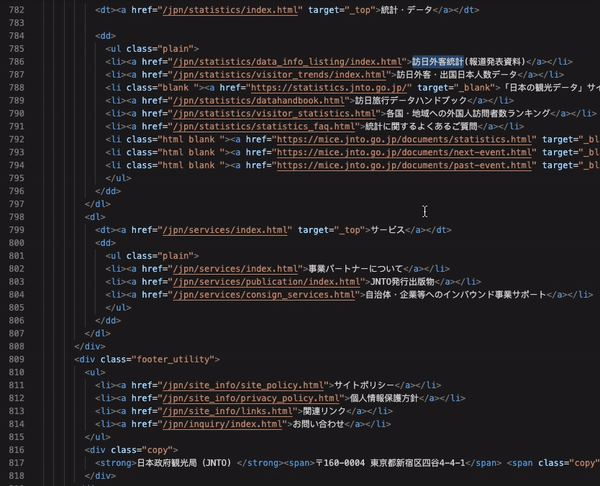

# Hover Translate

Hover translate is a vs code extension to translate text on hover.  Currently, this plugin uses Yandex translate and requires a yandex api key which you can obtain for free (https://tech.yandex.com/translate/). Support for google translate api may be added in the future.

## Features

## Requirements

* A yandex api key is required to use this plugin.
  * create a key https://tech.yandex.com/translate/
  * add key to hover translate settings (Yandex Api Key)

## Extension Settings

This extension contributes the following settings:

* `hovertranslate.enableExtension`: enable/disable this extension
* `hovertranslate.yandexApiKey`: Yandex translate api key
* `hovertranslate.translateFrom`: Language to translate text from
  * Options
    * Auto Detect Language
    * English
    * Japanese
    * French
    * Spanish
* `hovertranslate.translateTo`: Language to translate text to
  * Options
    * English
    * Japanese
    * French
    * Spanish

Note: This extension can support all language Yandex translate supports. This set was chosen for now. Submit a pr or open an issue if you want another one. (https://github.com/marclanepitt/hovertranslate)

## Known Issues

* Translating entire sentences can be difficult because the extension uses spaces a delimiter.  One hack to translate an entire sentence is to highlight it and then hover over the space to the right of it

## Release Notes

### 1.0.0

Initial release
* basic translate on text hover